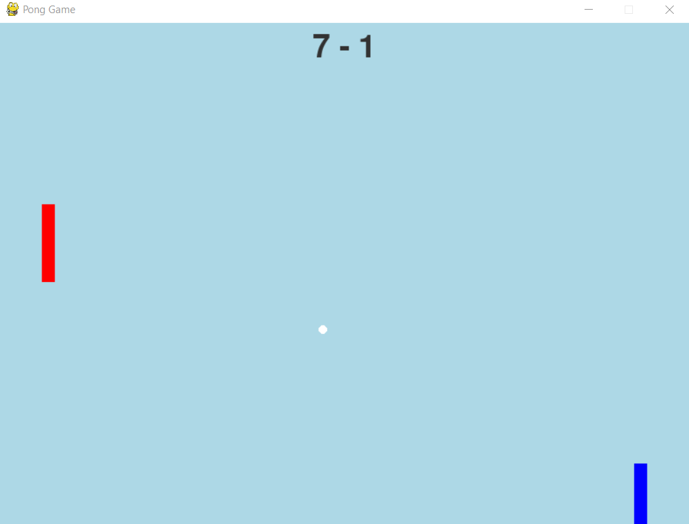

# PONG COM PYGAME
🎮JOGO DO PONG COM INTERFACE GRAFICA.

 <br>

## DESCRIÇÃO:
Este jogo é uma versão simples do clássico jogo de **Pong**, onde dois jogadores competem para marcar pontos ao fazer a bola passar pela raquete do adversário. O jogo é estruturado com um jogador controlado pelo computador e outro jogador controlado pelo usuário.

O objetivo é manter a bola em jogo e tentar fazer com que ela passe pela raquete do adversário para marcar pontos. O jogador que deixar a bola passar por sua raquete concede um ponto ao adversário.

## CONTROLES:
- **Jogador 2**:
  - **Seta para Cima (`UP`)**: Move a raquete para cima.
  - **Seta para Baixo (`DOWN`)**: Move a raquete para baixo.

## PONTUAÇÃO:
- **Marcar Pontos**: Um ponto é marcado quando a bola passa pela raquete do adversário.
  - **Se a bola ultrapassar a raquete do Jogador 1 (Computador)**: O Jogador 2 (Usuário) marca um ponto.
  - **Se a bola ultrapassar a raquete do Jogador 2 (Usuário)**: O Jogador 1 (Computador) marca um ponto.

## REGRAS:
1. **Movimento da Bola**:
   - A bola se move automaticamente pela tela e rebate nas bordas superior e inferior.
   - A direção da bola é alterada ao colidir com qualquer uma das raquetes.

2. **Limites**:
   - As raquetes dos jogadores não podem sair dos limites da tela e são restringidas ao movimento vertical.

## EXECUTANDO O JOGO:
1. **Instalando as dependências:**
   - Antes de executar o jogo, certifique-se de instalar todas as dependências necessárias. No terminal, execute o seguinte comando para instalar as dependências listadas no arquivo `requirements.txt` em `CODIGO`:
   ```bash
   pip install -r requirements.txt
   ```

2. **Inicie o Jogo:**
   - Inicie com o seguinte comando:
   ```bash
   python CODIGO.py
   ```

3. **Jogando:**
   1. **Jogador 1 (Computador)**:
      - Controlado pelo computador.
      - A raquete do Jogador 1 (à esquerda da tela) se move verticalmente para seguir a bola, tentando interceptá-la.

   2. **Jogador 2 (Usuário)**:
      - Controlado pelo usuário.
      - Use as teclas `UP` e `DOWN` para mover a raquete verticalmente (para cima e para baixo, respectivamente).
      - A raquete do Jogador 2 (à direita da tela) deve ser movida para interceptar a bola e evitar que ela passe por sua raquete.

## NÃO SABE?
- Entendemos que para manipular arquivos em muitas linguagens e tecnologias, é necessário possuir conhecimento nessas áreas. Para auxiliar nesse aprendizado, oferecemos cursos gratuitos disponíveis:
* [CURSO DE PYGAME](https://github.com/VILHALVA/CURSO-DE-PYGAME)
* [CURSO DE PYTHON](https://github.com/VILHALVA/CURSO-DE-PYTHON)
* [CONFIRA MAIS CURSOS](https://github.com/VILHALVA?tab=repositories&q=+topic:CURSO)

## CREDITOS:
- [PROJETO CRIADO PELO VILHALVA](https://github.com/VILHALVA)


